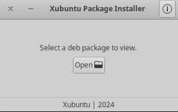
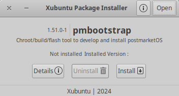
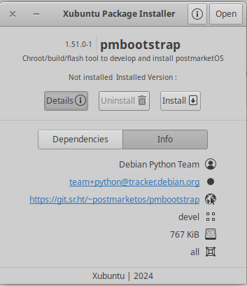
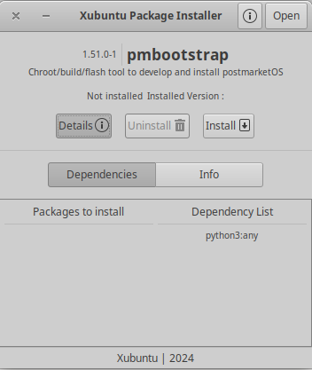
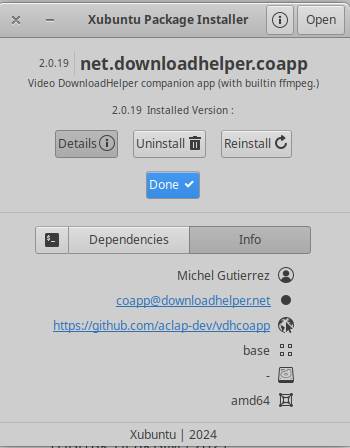

# Xubuntu Package Installer

Xubuntu Package Installer is a application for install, uninstall or view deb packages.

It is currently a work in progress. Maintenance is done by me based on Pardus Package Installer.

## **Dependencies**

This application is developed based on Python3 and GTK+ 3. Dependencies:
```bash
gir1.2-glib-2.0 gir1.2-gtk-3.0 gir1.2-notify-0.7 python3-apt
```

### **Run Application from Source**

Install dependencies
```bash
gir1.2-glib-2.0 gir1.2-gtk-3.0 gir1.2-notify-0.7 python3-apt
```
Clone the repository
```bash
git clone https://github.com/IAMLEGENDZ/xubuntu-package-installer.git ~/xubuntu-package-installer
```
Run application
```bash
python3 ~/xubuntu-package-installer/src/Main.py
```

### **Build deb package**

```bash
sudo apt install devscripts git-buildpackage
sudo mk-build-deps -ir
gbp buildpackage --git-export-dir=/tmp/build/xubuntu-package-installer -us -uc
```

### **Screenshots**











